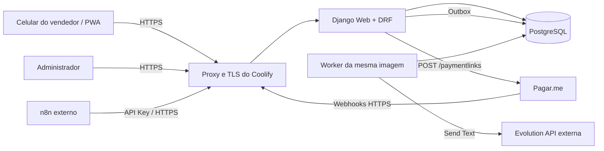

# Arquitetura técnica

> Vidalys Pay — Documentação final v1.0 — 21 de julho de 2026

## 1. Decisão de stack

### Escolha

- Python 3.13 ou versão suportada pelo Django selecionado;
- Django 5.2 LTS;
- Django REST Framework;
- PostgreSQL;
- Django Templates + HTMX + JavaScript pequeno;
- Gunicorn;
- Docker Compose;
- Coolify.

### Por que Django

Django reduz o tempo do MVP porque entrega administração, ORM, migrations, proteção CSRF, sessões, formulários, segurança e uma base madura. Go adicionaria mais trabalho de autenticação, painel administrativo e interface sem benefício proporcional para o volume previsto.

## 2. Visão de componentes



O worker não é uma nova tecnologia. É a mesma imagem Django executando outro comando para processar a outbox.

## 3. Containers

- `web`: Gunicorn, telas, API e webhooks.
- `worker`: comando Django para outbox/retries.
- `db`: PostgreSQL.

Evolution API e n8n não entram no Compose.

## 4. Módulos Django

```text
apps/
├── core/                 # configurações comuns, health, logging, utilitários
├── sellers/              # vendedores, convites e sessões
├── payment_links/        # links e tentativas de pagamento
├── webhooks/             # entrada, persistência e processamento
├── notifications/        # mensagens, templates e outbox
├── integrations/
│   ├── pagarme/          # cliente HTTP e mapeamentos
│   ├── evolution/        # cliente HTTP e normalização
│   └── n8n/              # opcional, eventos de saída
├── audit/                # trilha de auditoria
└── shipping/             # reservado, sem funcionalidade no MVP
```

## 5. Camadas

### Interface

Views Django/HTMX e endpoints DRF. Não acessam APIs externas diretamente.

### Aplicação

Casos de uso transacionais, por exemplo `CreatePaymentLink`, `ConsumeSellerInvitation` e `ProcessPagarmeWebhook`.

### Domínio

Regras de valor, parcelas, estados, permissões e transições.

### Infraestrutura

ORM, clientes HTTP, storage de sessão, logs e outbox.

## 6. Fluxo transacional de criação

1. Validar sessão do vendedor.
2. Validar payload e limite.
3. Reservar chave de idempotência.
4. Criar registro local em `CREATING`.
5. Chamar Pagar.me fora de uma transação longa.
6. Atualizar ID externo, URL e estado `ACTIVE`.
7. Inserir item na outbox na mesma transação do passo 6.
8. Retornar URL imediatamente ao vendedor.
9. Worker envia WhatsApp e registra resultado.

Se a resposta do Pagar.me for incerta por timeout, o item fica `CREATION_UNKNOWN`; um reconciliador deve consultar o provedor antes de repetir a criação.

## 7. Outbox e retries

A tabela `NotificationOutbox` evita perder mensagens depois de um pagamento aprovado. O worker usa bloqueio `SELECT ... FOR UPDATE SKIP LOCKED`, tenta o envio e aplica backoff:

- tentativa 1: imediata;
- tentativa 2: +1 minuto;
- tentativa 3: +5 minutos;
- tentativa 4: +15 minutos;
- tentativa 5: +1 hora;
- depois: `DEAD` para ação manual.

## 8. Concorrência e idempotência

- chave enviada pelo PWA/API em `Idempotency-Key`;
- restrição única `(actor_type, actor_id, idempotency_key)`;
- token de convite consumido com lock de linha;
- webhook com restrição única por `provider_event_id`;
- outbox com chave deduplicadora por evento + template + destinatário.

## 9. Observabilidade

Logs JSON com:

- timestamp;
- nível;
- serviço/processo;
- request_id;
- correlation_id;
- seller_id quando aplicável;
- payment_link_id;
- provider_event_id;
- duração;
- resultado sem dados secretos.

Métricas iniciais podem ser derivadas do banco e logs. Sentry/OpenTelemetry ficam como evolução, não dependência do MVP.

## 10. Health endpoints

- `/health`: processo está vivo; não consulta terceiros.
- `/ready`: verifica banco e migrations; não depende de Pagar.me ou Evolution para evitar derrubar o serviço por falha externa.

## 11. Disponibilidade de terceiros

- Pagar.me indisponível: não criar link fictício; informar erro e permitir nova tentativa segura.
- Evolution indisponível: manter link criado, exibir copiar/compartilhar e colocar mensagem na outbox.
- n8n indisponível: nenhum impacto no fluxo principal.

---

## Referências oficiais consultadas

Documentação consultada em 21/07/2026. Durante a implementação, validar novamente os contratos ativos da conta Pagar.me e a versão instalada da Evolution API.

1. Pagar.me — Criar link de pagamento: https://docs.pagar.me/reference/criar-link
2. Pagar.me — Checkout para cobrança pontual: https://docs.pagar.me/docs/checkout_pagarme_skill_order
3. Pagar.me — Visão geral sobre webhooks: https://docs.pagar.me/reference/vis%C3%A3o-geral-sobre-webhooks
4. Pagar.me — Eventos de webhook: https://docs.pagar.me/reference/eventos-de-webhook-1
5. Evolution API v2 — Send Plain Text: https://doc.evolution-api.com/v2/api-reference/message-controller/send-text
6. Coolify — Docker Compose: https://coolify.io/docs/knowledge-base/docker/compose
7. Coolify — Health checks: https://coolify.io/docs/knowledge-base/health-checks
8. Django — versões suportadas: https://www.djangoproject.com/download/
