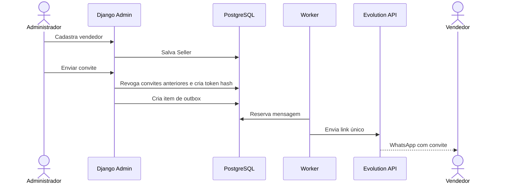
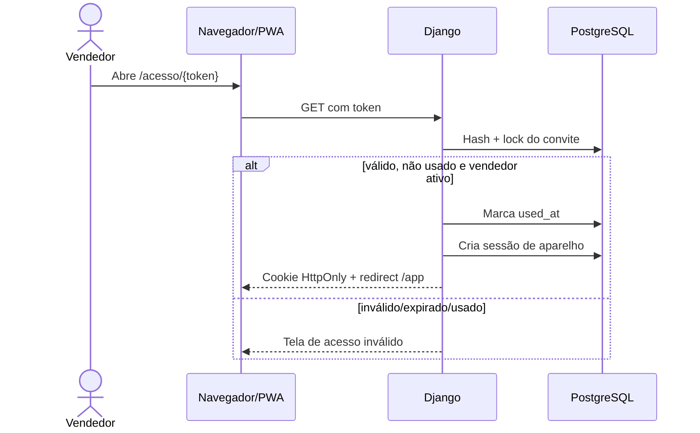
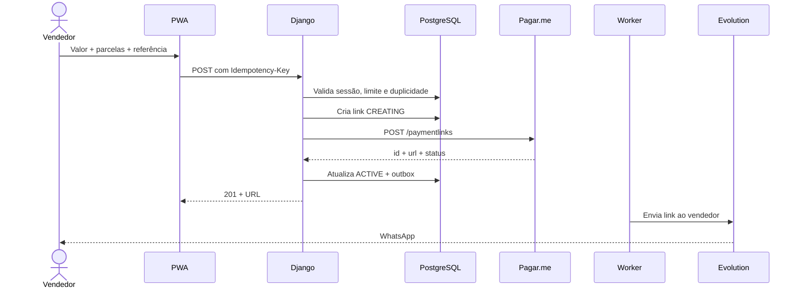
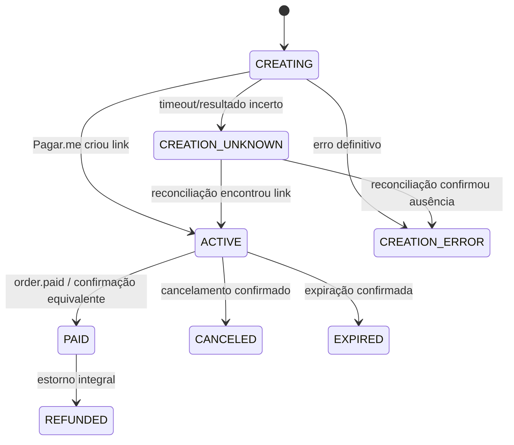

# Fluxos e máquinas de estado

> Vidalys Pay — Documentação final v1.0 — 21 de julho de 2026

## 1. Cadastro e convite

## 2. Ativação do aparelho

### Propriedades do convite

- aleatório com pelo menos 256 bits;
- URL-safe;
- armazenado apenas como SHA-256 + pepper opcional;
- validade padrão de 24 horas;
- uso único;
- consumido atomicamente;
- removido da URL por redirect;
- novos convites revogam os anteriores.

### Sessão do aparelho

- backend de sessão em banco;
- cookie próprio do vendedor;
- HttpOnly;
- Secure em produção;
- SameSite=Lax;
- validade padrão de 30 dias, renovação deslizante limitada;
- revogável pelo Admin;
- expira ao desativar vendedor.

Não usar fingerprint invasivo do dispositivo. Nome amigável do aparelho pode ser inferido do User-Agent e editado depois.

## 3. Criação do link

## 4. Máquina de estado do link

Estados do `PaymentLink`:

- `CREATING`;
- `CREATION_UNKNOWN`;
- `CREATION_ERROR`;
- `ACTIVE`;
- `PAID`;
- `CANCELED`;
- `EXPIRED`;
- `REFUNDED`.

## 5. Tentativas de pagamento

A falha pertence à tentativa, não necessariamente ao link.

Estados do `PaymentAttempt`:

- `PENDING`;
- `PROCESSING`;
- `PAID`;
- `FAILED`;
- `REFUNDED`;
- `CHARGEDBACK`.

Exemplo: `order.payment_failed` cria ou atualiza uma tentativa como `FAILED`, mas mantém o link `ACTIVE` enquanto o Pagar.me permitir nova tentativa.

## 6. Processamento de webhook

1. Receber body bruto.
2. Rejeitar tamanho excessivo.
3. Persistir evento bruto com hash.
4. Detectar duplicidade.
5. Validar autenticidade conforme o mecanismo oficial disponível na conta/versão.
6. Mapear evento por versão.
7. Atualizar link/tentativa em transação.
8. Criar notificações na outbox.
9. Marcar processado.
10. Responder 2xx.

### Eventos mínimos

- `order.paid`;
- `order.payment_failed`;
- `order.canceled`;
- `charge.paid` como confirmação complementar;
- `charge.payment_failed`;
- `charge.refunded`;
- `charge.pending`;
- `charge.processing`;
- `checkout.canceled`;
- `checkout.closed`, apenas após validar semântica do payload.

Eventos desconhecidos são registrados como `IGNORED`, nunca descartados silenciosamente.

## 7. Cancelamento

O vendedor pode solicitar cancelamento apenas de link `ACTIVE`, se a política permitir. O backend chama o endpoint oficial de cancelamento do link e só altera o estado local após resposta confirmada ou webhook. Em resultado incerto, marca uma pendência de reconciliação.

---

## Referências oficiais consultadas

Documentação consultada em 21/07/2026. Durante a implementação, validar novamente os contratos ativos da conta Pagar.me e a versão instalada da Evolution API.

1. Pagar.me — Criar link de pagamento: https://docs.pagar.me/reference/criar-link
2. Pagar.me — Checkout para cobrança pontual: https://docs.pagar.me/docs/checkout_pagarme_skill_order
3. Pagar.me — Visão geral sobre webhooks: https://docs.pagar.me/reference/vis%C3%A3o-geral-sobre-webhooks
4. Pagar.me — Eventos de webhook: https://docs.pagar.me/reference/eventos-de-webhook-1
5. Evolution API v2 — Send Plain Text: https://doc.evolution-api.com/v2/api-reference/message-controller/send-text
6. Coolify — Docker Compose: https://coolify.io/docs/knowledge-base/docker/compose
7. Coolify — Health checks: https://coolify.io/docs/knowledge-base/health-checks
8. Django — versões suportadas: https://www.djangoproject.com/download/
