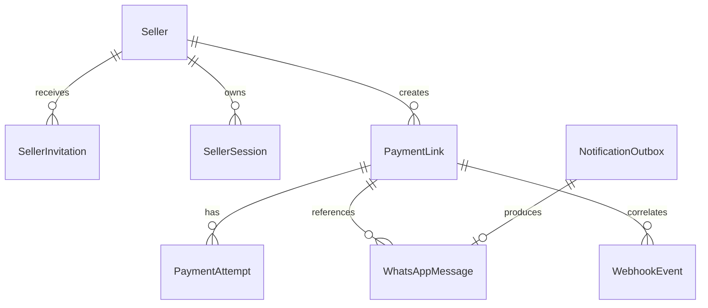

# Modelo de dados

> Vidalys Pay — Documentação final v1.0 — 21 de julho de 2026

## 1. Convenções

- UUID v7 ou UUID aleatório para IDs públicos/internos.
- Datas em UTC no banco.
- Dinheiro como `BigInteger` em centavos.
- Telefones normalizados em E.164.
- Payloads externos em `JSONField`.
- Campos sensíveis mascarados no Admin e logs.

## 2. Entidades

### Seller

| Campo | Tipo | Regra |
|---|---|---|
| id | UUID | PK |
| name | varchar(120) | obrigatório |
| whatsapp_phone | varchar(20) | E.164, único para ativos quando aplicável |
| is_active | boolean | padrão true |
| max_payment_amount_cents | bigint | obrigatório, > 0 |
| created_at | timestamptz | automático |
| updated_at | timestamptz | automático |

### SellerInvitation

| Campo | Tipo | Regra |
|---|---|---|
| id | UUID | PK |
| seller_id | FK | obrigatório |
| token_hash | char(64) | único, nunca guardar token puro |
| expires_at | timestamptz | obrigatório |
| used_at | timestamptz | nullable |
| revoked_at | timestamptz | nullable |
| created_by_id | FK admin | auditoria |
| created_at | timestamptz | automático |

Índice para convites ativos por vendedor. Restrição lógica: somente um convite válido por vendedor.

### SellerSession

| Campo | Tipo | Regra |
|---|---|---|
| id | UUID | PK |
| seller_id | FK | obrigatório |
| django_session_key | varchar(40) | único |
| device_label | varchar(120) | opcional |
| user_agent_summary | varchar(255) | minimizado |
| ip_first | inet | opcional, retenção curta |
| last_seen_at | timestamptz | atualizado com limite de frequência |
| expires_at | timestamptz | obrigatório |
| revoked_at | timestamptz | nullable |
| created_at | timestamptz | automático |

### PaymentLink

| Campo | Tipo | Regra |
|---|---|---|
| id | UUID | PK |
| seller_id | FK | obrigatório |
| reference | varchar(80) | obrigatório |
| customer_name | varchar(120) | opcional |
| customer_phone | varchar(20) | opcional, E.164 |
| description | varchar(255) | opcional |
| amount_cents | bigint | > 0 |
| installments | smallint | 1..3 |
| status | enum | estado interno |
| provider | varchar | `pagarme` |
| provider_link_id | varchar(100) | único, nullable até criar |
| payment_url | text | nullable até criar |
| provider_status | varchar(80) | espelho informativo |
| expires_at | timestamptz | opcional |
| paid_at | timestamptz | opcional |
| canceled_at | timestamptz | opcional |
| refunded_at | timestamptz | opcional |
| creation_request | jsonb | sanitizado |
| creation_response | jsonb | sanitizado |
| idempotency_key | varchar(100) | obrigatório |
| created_at | timestamptz | automático |
| updated_at | timestamptz | automático |

Restrições:

- `installments BETWEEN 1 AND 3`;
- `amount_cents > 0`;
- único `(seller_id, idempotency_key)`;
- único `provider_link_id` quando preenchido.

### PaymentAttempt

| Campo | Tipo | Regra |
|---|---|---|
| id | UUID | PK |
| payment_link_id | FK | obrigatório |
| provider_order_id | varchar(100) | indexado |
| provider_charge_id | varchar(100) | indexado |
| status | enum | tentativa |
| amount_cents | bigint | valor observado |
| installments | smallint | quando disponível |
| failure_code | varchar(100) | opcional |
| failure_message | varchar(255) | sanitizado |
| paid_at | timestamptz | opcional |
| raw_summary | jsonb | sem dados sensíveis |
| created_at | timestamptz | automático |
| updated_at | timestamptz | automático |

### WebhookEvent

| Campo | Tipo | Regra |
|---|---|---|
| id | UUID | PK |
| provider | varchar | `pagarme` |
| provider_event_id | varchar(120) | único quando fornecido |
| event_type | varchar(120) | obrigatório |
| payload | jsonb | bruto |
| payload_sha256 | char(64) | deduplicação auxiliar |
| headers_summary | jsonb | apenas cabeçalhos permitidos |
| authenticity_status | enum | VERIFIED/UNVERIFIED/INVALID |
| processing_status | enum | RECEIVED/PROCESSED/IGNORED/FAILED |
| attempts | integer | padrão 0 |
| error_code | varchar(100) | opcional |
| error_detail | text | sanitizado |
| received_at | timestamptz | automático |
| processed_at | timestamptz | opcional |

### WhatsAppMessage

| Campo | Tipo | Regra |
|---|---|---|
| id | UUID | PK |
| seller_id | FK | destinatário lógico |
| payment_link_id | FK | opcional |
| template_key | varchar(80) | obrigatório |
| recipient_phone | varchar(20) | E.164 |
| rendered_text | text | conteúdo enviado |
| provider_message_id | varchar(120) | opcional |
| status | enum | QUEUED/SENDING/SENT/FAILED/DEAD |
| provider_status | varchar(80) | opcional |
| attempt_count | integer | padrão 0 |
| last_error | text | sanitizado |
| sent_at | timestamptz | opcional |
| created_at | timestamptz | automático |

### NotificationOutbox

| Campo | Tipo | Regra |
|---|---|---|
| id | UUID | PK |
| topic | varchar(80) | ex. `whatsapp.send` |
| aggregate_type | varchar(80) | ex. `payment_link` |
| aggregate_id | UUID | indexado |
| deduplication_key | varchar(180) | único |
| payload | jsonb | mínimo necessário |
| status | enum | PENDING/PROCESSING/DONE/DEAD |
| available_at | timestamptz | retry |
| locked_at | timestamptz | opcional |
| locked_by | varchar(100) | opcional |
| attempts | integer | padrão 0 |
| last_error | text | sanitizado |
| created_at | timestamptz | automático |
| processed_at | timestamptz | opcional |

### IdempotencyRecord

| Campo | Tipo | Regra |
|---|---|---|
| id | UUID | PK |
| actor_type | varchar(30) | seller/api_client |
| actor_id | varchar(80) | obrigatório |
| key | varchar(100) | obrigatório |
| request_hash | char(64) | detecta reutilização diferente |
| response_status | integer | opcional |
| response_body | jsonb | opcional |
| resource_id | UUID | opcional |
| expires_at | timestamptz | obrigatório |

Único `(actor_type, actor_id, key)`.

### ApiClient

| Campo | Tipo | Regra |
|---|---|---|
| id | UUID | PK |
| name | varchar(120) | ex. n8n |
| key_prefix | varchar(12) | identificação visual |
| key_hash | char(64) | segredo em hash |
| scopes | array/json | permissões |
| is_active | boolean | padrão true |
| last_used_at | timestamptz | opcional |
| created_at | timestamptz | automático |

### AuditLog

Registra ações administrativas e mudanças críticas com ator, ação, entidade, valores anteriores/posteriores sanitizados, IP e data.

## 3. Relacionamentos

## 4. Retenção

- links, tentativas e auditoria: conforme política fiscal/comercial, recomendação inicial 5 anos;
- webhooks brutos: 12 a 24 meses, depois anonimizar ou remover conforme necessidade;
- sessões e convites: apagar ou anonimizar registros antigos após 12 meses;
- IPs: retenção mínima e justificada;
- mensagens: avaliar retenção de 12 meses, mascarando dados pessoais.

---

## Referências oficiais consultadas

Documentação consultada em 21/07/2026. Durante a implementação, validar novamente os contratos ativos da conta Pagar.me e a versão instalada da Evolution API.

1. Pagar.me — Criar link de pagamento: https://docs.pagar.me/reference/criar-link
2. Pagar.me — Checkout para cobrança pontual: https://docs.pagar.me/docs/checkout_pagarme_skill_order
3. Pagar.me — Visão geral sobre webhooks: https://docs.pagar.me/reference/vis%C3%A3o-geral-sobre-webhooks
4. Pagar.me — Eventos de webhook: https://docs.pagar.me/reference/eventos-de-webhook-1
5. Evolution API v2 — Send Plain Text: https://doc.evolution-api.com/v2/api-reference/message-controller/send-text
6. Coolify — Docker Compose: https://coolify.io/docs/knowledge-base/docker/compose
7. Coolify — Health checks: https://coolify.io/docs/knowledge-base/health-checks
8. Django — versões suportadas: https://www.djangoproject.com/download/
